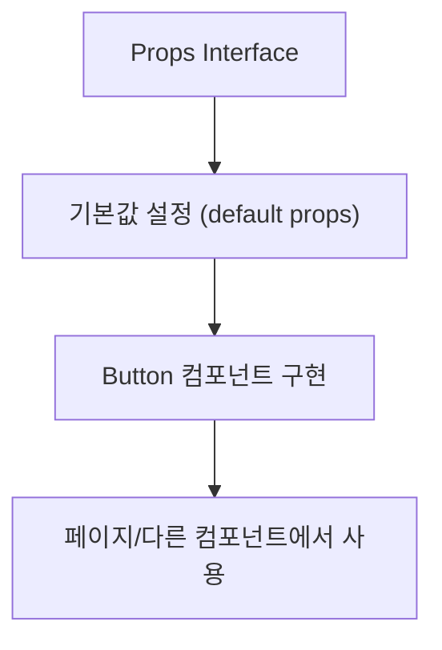

# 📘 컴포넌트 만들기 가이드라인

## 📋 개요
컴포넌트를 만들때 참고할 내용을 정리한 문서입니다.

<br>

## 📖 목차
- [컴포넌트를 분리하는 이유]("분리하는_이유")
- [컴포넌트의 구조]("컴포넌트_구조")
- [버튼으로 알아보는 예시]("버튼_예시")

<br>

<a id="분리하는_이유"></a>
## ❓ 컴포넌트를 분리하는 이유

React 에서는 **"재사용 가능한 컴포넌트는 분리한다."** 라는 원칙이 있는데 그 이유를 간단히 알아보자.

1. **중복 코드 방지** <br>
  같은 UI나 로직을 여러 군데에서 쓰게 될 때, 매번 복붙하면 수정할 때 모든 곳을 고쳐야 해서 유지보수가 힘들어지지만, <br>
  → 한 번만 만들어서 재사용하면 수정은 한 곳에서 끝난다.
2. **가독성 향상** <br>
   UI 구조를 작은 단위로 쪼개면 부모 컴포넌트가 훨씬 읽기 쉬워지고 전체 페이지의 구조가 명확해진다. <br>
  ```tsx
  {/* example */}
  <Header />  
  <Gallery />  
  <Diary />  
  <Footer />
  ```
3. **테스트와 디버깅 용이** <br>
   독립된 컴포넌트 단위로 테스트할 수 있으니 버그 추적이 쉽다.
4. **스타일 및 기능 확장성** <br>
   동일한 컴포넌트를 props만 바꿔서 다른 곳에서도 다양한 용도로 쓸 수 있다.

<br>

이러한 이유로 컴포넌트 파일을 분리해 관리한다.

<br>

<a id="컴포넌트_구조"></a>
## 🔗 컴포넌트의 구조



<br>

<a id="버튼_예시"></a>
## 👀 버튼으로 알아보는 예시

### ButtonProps 인터페이스 설명

`ButtonProps`는 재사용 가능한 버튼 컴포넌트가 받을 수 있는 속성(props)을 정의한 TypeScript 인터페이스이다..  
이를 통해 버튼의 스타일, 크기, 동작 등을 제어할 수 있다.

<br>

---

### 📌 Props 설명

> 설명을 위해 다른 프로젝트의 Button Props 내용을 가져왔다.

| Props       | 타입 | 설명 |
|-------------|------|------|
| **children** | `React.ReactNode` | 버튼 안에 들어갈 내용 (텍스트, 아이콘 등) |
| **variant**  | `'custom'` / `'primary'` / `'secondary'` / `'danger'` / `'ghost'` / `'success'` / `'noneBorder'` | 버튼 스타일 종류 |
| **size**     | `'custom'` / `'small'` / `'medium'` / `'large'` | 버튼 크기 종류 |
| **className**| `string` | 추가 CSS 클래스 |
| **onClick**  | `() => void` | 클릭 시 실행되는 함수 |
| **disabled** | `boolean` | 버튼 비활성화 여부 |
| **type**     | `'button'` / `'submit'` / `'reset'` | HTML 버튼 타입 |
| **fullWidth**| `boolean` | 버튼의 가로 길이를 100%로 설정 |

> 추가할만한 Props <br>
> hover | `boolean` | false = 호버 X / true = 지정된 hover action <br>
> shadow | `'none'` / `'small'` / `'medium'` / `'large'` | shadow 크기 <br>
> 등


---

### 💻 코드 예시

> Props interface
```ts
interface ButtonProps {
  children: React.ReactNode;
  variant?: 'custom' | 'primary' | 'secondary' | 'danger' | 'ghost' | 'success' | 'noneBorder';
  size?: 'custom' | 'small' | 'medium' | 'large';
  className?: string;
  onClick?: () => void;
  disabled?: boolean;
  type?: 'button' | 'submit' | 'reset';
  fullWidth?: boolean;
}
```

---

### 🛠 사용 예시

> 기본값 설정 (default props)
```tsx
import React from 'react';

const Button: React.FC<ButtonProps> = ({
  children,
  variant = 'primary',
  size = 'medium',
  className = '',
  onClick,
  disabled = false,
  type = 'button',
  fullWidth = false
}) => {
```

> Button 컴포넌트 구현
```tsx
  const baseStyle = 'px-4 py-2 rounded font-semibold';
  const variantStyle = {
    primary: 'bg-blue-500 text-white',
    secondary: 'bg-gray-500 text-white',
    danger: 'bg-red-500 text-white',
    success: 'bg-green-500 text-white',
    ghost: 'bg-transparent text-gray-700',
    custom: '',
    noneBorder: 'border-none'
  }[variant];

  const sizeStyle = {
    small: 'text-sm',
    medium: 'text-base',
    large: 'text-lg',
    custom: ''
  }[size];

  return (
    <button
      type={type}
      onClick={onClick}
      disabled={disabled}
      className={`${baseStyle} ${variantStyle} ${sizeStyle} ${fullWidth ? 'w-full' : ''} ${className}`}
    >
      {children}
    </button>
  );
};

export default Button;
```

---

> 페이지/다른 컴포넌트에서 사용
```tsx
import Button from '../common/Button'

<Button
  variant="custom"
  size="custom"
  onClick={() => setMobileMenuOpen(true)}
  className="-m-2.5 inline-flex items-center justify-center rounded-md p-2.5 text-gray-700"
>
  <Bars3Icon aria-hidden="true" className="size-6" />
</Button>
```

---

```
🌕🌖🌗🌘🌑🌒🌓🌔 🌙

🌕🌕🌕🌕🌕🌕🌕🌕🌕🌕🌕🌕
🌕🌕🌕🌒🌕🌖🌒🌕🌕🌕🌕🌕
🌕🌕🌖🌑🌓🌑🌑🌕🌕🌕🌕🌕
🌕🌕🌗🌑🌑🌑🌑🌔🌕🌕🌕🌕
🌕🌕🌘🌙🌑🌙🌑🌓🌖🌑🌕🌕
🌕🌕🌖🌑🌑🌑🌑🌕🌕🌑🌔🌕
🌕🌕🌕🌖🌑🌑🌔🌕🌕🌑🌔🌕
🌕🌕🌕🌘🌑🌑🌒🌕🌕🌑🌔🌕
🌕🌕🌕🌘🌑🌑🌑🌔🌖🌑🌕🌕
🌕🌕🌕🌑🌑🌑🌑🌒🌑🌒🌕🌕
🌕🌕🌕🌑🌑🌑🌑🌑🌒🌕🌕🌕

🌕🌕🌕🌕🌕🌕🌕🌕🌕🌕🌕🌕
🌕🌕🌖🌒🌖🌒🌕🌕🌕🌕🌕🌕
🌕🌕🌗🌑🌑🌑🌔🌕🌘🌕🌕🌕
🌕🌕🌘🌙🌑🌙🌒🌕🌑🌕🌕🌕
🌕🌕🌖🌑🌑🌑🌓🌕🌑🌕🌕🌕
🌕🌕🌕🌘🌑🌒🌕🌕🌑🌕🌕🌕
🌕🌕🌕🌗🌑🌑🌓🌘🌒🌕🌕🌕
🌕🌕🌕🌘🌑🌑🌑🌑🌓🌕🌕🌕
```
