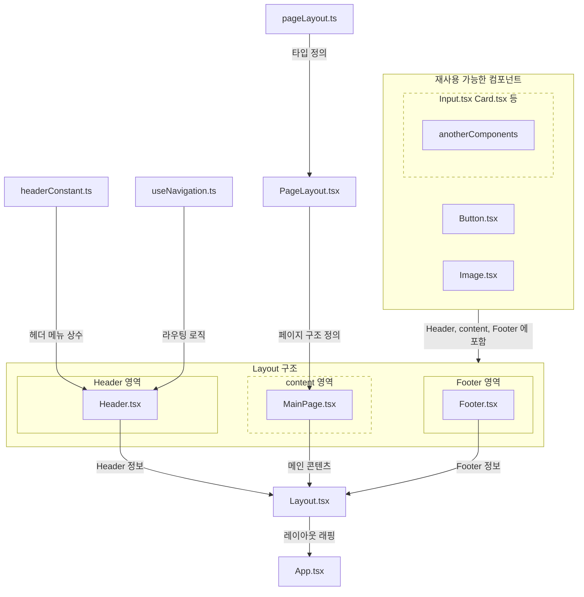
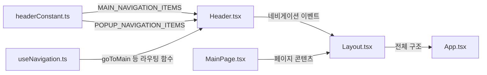

# 📂 Frontend File Structure

## 📋 개요
프론트엔드 폴더 구조를 보여주는 문서입니다.

<br>

## 👀 폴더 구조 한눈에 보기

```bash
frontend/                   # FE 루트 폴더
├── src/
│   ├── components/         # 재사용 가능한 컴포넌트
│   │   ├── common/         # 공통 컴포넌트 (Button, Input 등)
│   │   ├── layout/         # 레이아웃 컴포넌트 (Header, Footer, Sidebar)
│   │   └── pageName/       # 페이지별 전용 컴포넌트
│   ├── constants/          # 상수 정의 (API URL, 텍스트 등)
│   ├── hooks/              # 커스텀 React 훅
│   ├── pages/              # 페이지 컴포넌트
│   ├── types/              # TypeScript 타입 정의
│   ├── utils/              # 유틸리티 함수
│   ├── App.tsx             # 메인 앱 컴포넌트 및 라우팅
│   ├── index.css           # 글로벌 스타일 (Tailwind CSS 포함)
│   └── main.tsx            # 애플리케이션 진입점
├── index.html              # HTML 템플릿
└── .*                      # 설정 파일 (package.json, tsconfig.json 등)
```

<br>

## 📚 폴더 구조 표로 보기

|폴더명|설명|예시|
|---|-----|-----|
|frontend/|FE root folder||
|src/components/|재사용 가능한 컴포넌트 폴더|common/ layout/ 등|
|components/common/|공통 컴포넌트 폴더|Button.tsx Input.tsx 등|
|components/layout/|레이아웃 컴포넌트 폴더|Header.tsx Footer.tsx Sidebar.tsx 등|
|components/pageName/|페이지 컴포넌트 폴더|components/main/ components/profile/ 등|
|src/constants/|상수 정의 폴더|API URL, Text 등|
|src/hooks|커스텀 React 훅 폴더|useScrollTo.ts(커스텀 스크롤 훅) 등|
|src/pages/|페이지 컴포넌트|main.tsx profile.tsx 등|
|src/types/|TypeScript 타입 정의 폴더|mainType.ts 등|
|src/utils|유틸리티 함수 폴더|날짜 시간관련 함수, 문자열 처리 함수 등|
|src/App.tsx|메인 앱 컴포넌트 및 라우팅||
|src/index.css|글로벌 스타일|Tailwind CSS 등|
|src/main.tsx|애플리케이션 진입점||
|frontend/index.html|HTML 템플릿||
|frontend/.*|설정파일|package.json, tsconfig.json 등|

<br>

***

<br>

## 🔗 컴포넌트 관계도



## 🌊 데이터의 흐름도



